# Instagram Stories Webhook - Comprehensive UML Diagrams

This document contains detailed UML diagrams showing the system architecture, data flows, and key workflows.

---

## 1. ENTITY RELATIONSHIP DIAGRAM (ERD)

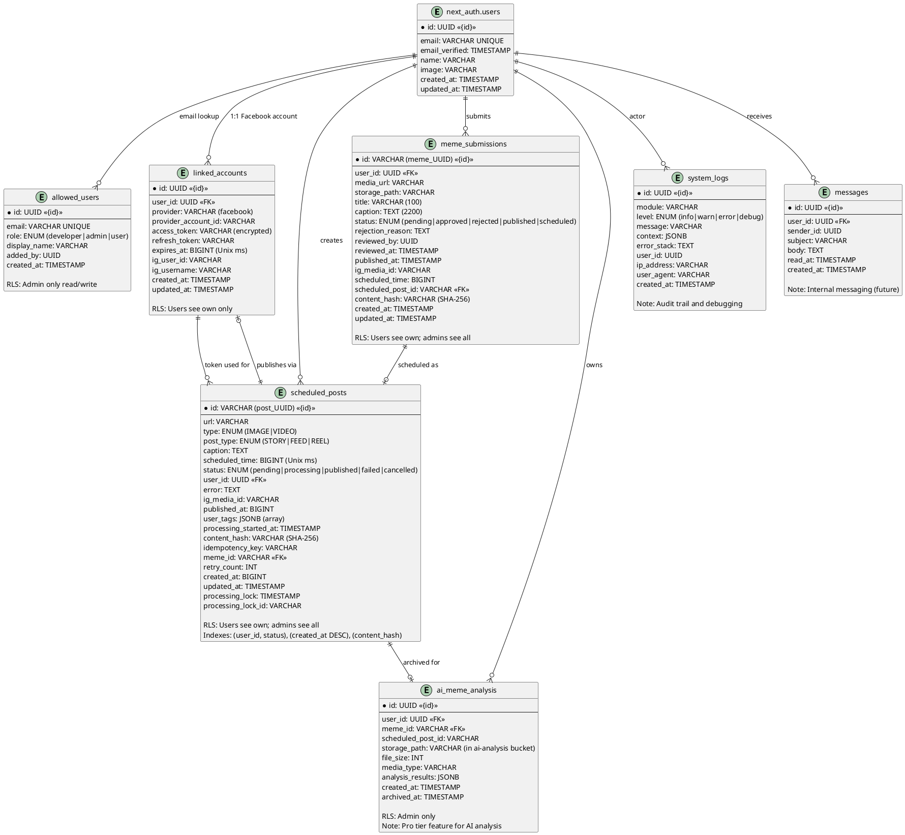

---

## 2. CLASS DIAGRAM - Services & Business Logic

```plantuml
@startuml class_diagram
!theme plain
scale 1.5

' === AUTHENTICATION & AUTHORIZATION ===
package "Authentication & Authorization" {
  class NextAuthConfig {
    +providers: GoogleProvider[]
    +adapter: SupabaseAdapter
    +callbacks: Object
    --
    +signInCallback(): boolean
    +jwtCallback(token, account): Token
    +sessionCallback(session, token): Session
  }

  class AuthHelpers {
    +isAdmin(session): boolean
    +isDeveloper(session): boolean
    +requireAdmin(session): void
    +requireDeveloper(session): void
    +getUserId(session): string
    +getUserRole(session): UserRole
  }

  class AuthMiddleware {
    +matcher: string[]
    +protectedRoutes: string[]
    +publicRoutes: string[]
    +execute(request): NextResponse
  }
}

' === DATABASE SERVICES ===
package "Database Services" {
  interface IScheduledPost {
    id: string
    url: string
    type: MediaType
    status: PostStatus
    scheduledTime: number
    userId: string
  }

  class ScheduledPostService {
    -supabaseAdmin: SupabaseClient
    --
    +getScheduledPosts(userId?): Promise<ScheduledPost[]>
    +getAllScheduledPosts(): Promise<ScheduledPost[]>
    +addScheduledPost(post): Promise<ScheduledPostWithUser>
    +updateScheduledPost(id, updates): Promise<ScheduledPost>
    +deleteScheduledPost(id): Promise<boolean>
    +getPendingPosts(): Promise<ScheduledPostWithUser[]>
    +acquireProcessingLock(postId): Promise<boolean>
    +releaseProcessingLock(postId, lockId): Promise<void>
  }

  interface ILinkedAccount {
    id: string
    userId: string
    accessToken: string
    expiresAt: number
    igUserId: string
  }

  class LinkedAccountService {
    -supabaseAdmin: SupabaseClient
    --
    +getLinkedAccount(userId): Promise<LinkedAccount>
    +saveLinkedAccount(account): Promise<void>
    +getFacebookAccessToken(userId): Promise<string>
    +getInstagramUserId(userId): Promise<string>
    +refreshAccessToken(userId): Promise<void>
    +validateTokenExpiry(userId): Promise<boolean>
  }

  class MemeSubmissionService {
    -supabaseAdmin: SupabaseClient
    --
    +getMemeSubmission(id): Promise<MemeSubmission>
    +createMemeSubmission(input): Promise<MemeSubmission>
    +updateMemeSubmission(id, updates): Promise<MemeSubmission>
    +reviewMemeSubmission(id, adminId, action): Promise<MemeSubmission>
    +scheduleMeme(memeId, time): Promise<MemeSubmission>
    +deleteMemeSubmission(id): Promise<boolean>
    +checkForDuplicates(userId, contentHash): Promise<MemeSubmission>
  }

  class AllowedUserService {
    -supabaseAdmin: SupabaseClient
    --
    +isEmailAllowed(email): Promise<boolean>
    +getUserRole(email): Promise<UserRole>
    +getAllowedUsers(): Promise<AllowedUser[]>
    +addAllowedUser(email, role): Promise<AllowedUser>
    +removeAllowedUser(email): Promise<boolean>
    +updateUserRole(email, role): Promise<boolean>
  }
}

' === INSTAGRAM API SERVICES ===
package "Instagram API Services" {
  interface IMediaPublishRequest {
    url: string
    mediaType: string
    postType: string
    caption?: string
    userTags?: UserTag[]
  }

  class PublishingService {
    -retryPolicy: RetryPolicy
    -logger: Logger
    --
    +publishMedia(request): Promise<PublishResult>
    #createContainer(url, type): Promise<containerId>
    #waitForContainerReady(containerId): Promise<void>
    #publishContainer(containerId): Promise<igMediaId>
    #handlePublishError(error): PublishError
  }

  class ContainerService {
    -maxAttempts: number = 30
    -delayMs: number = 2000
    --
    +checkStatus(containerId): Promise<ContainerStatus>
    +waitForReady(containerId): Promise<void>
  }

  class QuotaService {
    +getContentPublishingLimit(igUserId): Promise<QuotaInfo>
    +getRemainingQuota(igUserId): Promise<number>
    +hasQuotaAvailable(igUserId): Promise<boolean>
  }

  class InsightsService {
    +getMediaInsights(igMediaId, postType): Promise<Insight[]>
    +getMetricsForStory(igMediaId): Promise<StoryMetrics>
    +getMetricsForFeed(igMediaId): Promise<FeedMetrics>
  }

  class AccountService {
    +getInstagramUsername(igUserId): Promise<string>
    +validateAccountAccess(igUserId, token): Promise<boolean>
  }
}

' === SCHEDULER & PROCESSING ===
package "Scheduler & Processing" {
  class ProcessingService {
    -lockService: LockService
    -publishingService: PublishingService
    -duplicateDetection: DuplicateDetectionService
    --
    +processScheduledPosts(postId?): Promise<BatchResult>
    #processSinglePost(post): Promise<ProcessResult>
    #validatePostBeforePublish(post): Promise<ValidationResult>
    #handlePublishSuccess(post, igMediaId): Promise<void>
    #handlePublishFailure(post, error): Promise<void>
  }

  class LockService {
    -lockDuration: number = 1800000
    --
    +acquireLock(postId): Promise<boolean>
    +releaseLock(postId, lockId): Promise<void>
    +isLockStale(lockTime): boolean
  }

  class DuplicateDetectionService {
    +generateContentHash(url): Promise<string>
    +checkForRecentPublish(hash, userId): Promise<boolean>
    +isMemeAlreadyScheduled(memeId): Promise<boolean>
    +findDuplicateSubmission(userId, hash): Promise<MemeSubmission>
  }

  class CleanupService {
    -storageClient: SupabaseStorageClient
    -retentionHours: number = 24
    --
    +cleanupOldMedia(): Promise<void>
    #deleteStorageFile(path): Promise<void>
  }

  class IdentityAuditService {
    +auditUserAccounts(): Promise<AuditResult>
    #validateTokens(): Promise<InvalidToken[]>
    #validateInstagramAccess(): Promise<InvalidAccount[]>
  }
}

' === MEDIA PROCESSING ===
package "Media Processing" {
  class MediaValidator {
    +validateForStories(dimensions): ValidationResult
    +analyzeAspectRatio(width, height): AspectRatioInfo
    #checkIdealDimensions(ratio): boolean
  }

  class VideoProcessor {
    +transcodeVideo(input): Promise<output>
    +detectVideoCodec(file): Promise<Codec>
    #encodeToMP4(input): Promise<output>
  }

  class PHashService {
    +generateImageHash(url): Promise<string>
    +compareSimilarity(hash1, hash2): number
  }

  class ServerValidator {
    +validateMediaFile(url): Promise<FileInfo>
    +getMediaDimensions(url): Promise<Dimensions>
  }
}

' === UTILITY SERVICES ===
package "Utility Services" {
  class RetryService {
    -maxRetries: number
    -baseDelay: number
    --
    +withRetry(fn, options?): Promise<T>
    #calculateBackoff(attempt): number
    #isRetryableError(error): boolean
  }

  class LoggerService {
    +info(module, message, context?): Promise<void>
    +warn(module, message, error?): Promise<void>
    +error(module, message, error?): Promise<void>
    +debug(module, message, context?): Promise<void>
  }

  class CryptoService {
    +createSignedState(payload, secret): string
    +verifySignedState(state, secret): Object | null
    +generateIdempotencyKey(): string
  }

  class NotificationService {
    +createNotification(userId, type, message): Promise<void>
    +sendEmailNotification(email, subject, body): Promise<void>
  }

  class MemeArchiverService {
    +saveMemeForAnalysis(memeId, postId, url): Promise<void>
    #downloadMediaFile(url): Promise<Buffer>
    #uploadToAnalysisBucket(buffer): Promise<path>
  }
}

' === VALIDATIONS ===
package "Validation Schemas" {
  class MemeValidationSchemas {
    +submitMemeSchema: ZodSchema
    +reviewMemeSchema: ZodSchema
    +schedulePostSchema: ZodSchema
  }

  class AuthValidationSchemas {
    +linkFacebookSchema: ZodSchema
    +extendTokenSchema: ZodSchema
  }
}

' === RELATIONSHIPS ===
ScheduledPostService --> IScheduledPost: manages
ScheduledPostService --> LockService: uses
ScheduledPostService --> DuplicateDetectionService: uses

LinkedAccountService --> ILinkedAccount: manages
LinkedAccountService --> RetryService: uses token refresh

ProcessingService --> ScheduledPostService: queries
ProcessingService --> PublishingService: delegates
ProcessingService --> DuplicateDetectionService: validates
ProcessingService --> LockService: manages locks
ProcessingService --> LoggerService: logs

PublishingService --> ContainerService: uses
PublishingService --> LinkedAccountService: gets tokens
PublishingService --> RetryService: retries failures

MemeSubmissionService --> DuplicateDetectionService: checks dupes
MemeSubmissionService --> ScheduledPostService: creates post
MemeSubmissionService --> LoggerService: logs

AllowedUserService --> AuthMiddleware: validates whitelist

AuthHelpers --> NextAuthConfig: reads session

ProcessingService --> CleanupService: triggers cleanup
ProcessingService --> MemeArchiverService: archives published

AuthMiddleware --> AuthHelpers: authorization checks

@enduml
```

---

## 3. SEQUENCE DIAGRAM - Meme Submission to Publishing

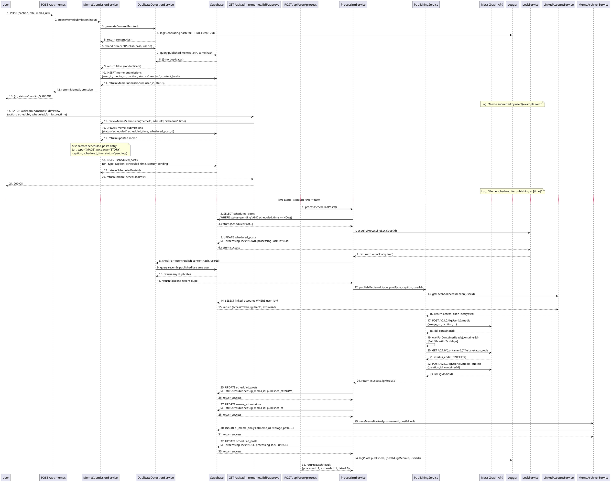

---

## 4. SEQUENCE DIAGRAM - Webhook Direct Publishing

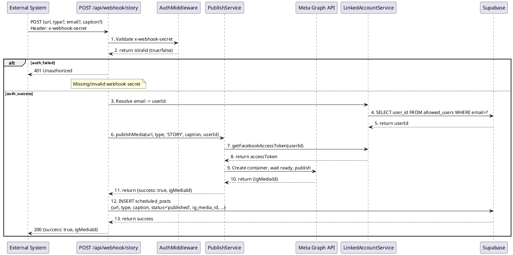

---

## 5. ACTIVITY DIAGRAM - Cron Processing Flow

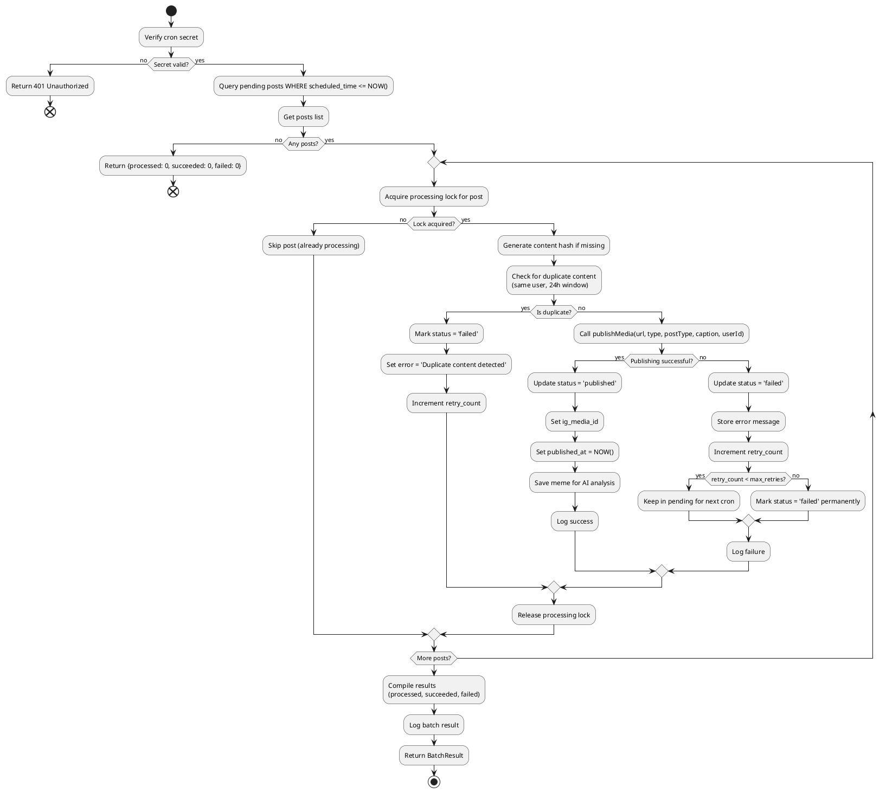

---

## 6. STATE DIAGRAM - Scheduled Post Lifecycle

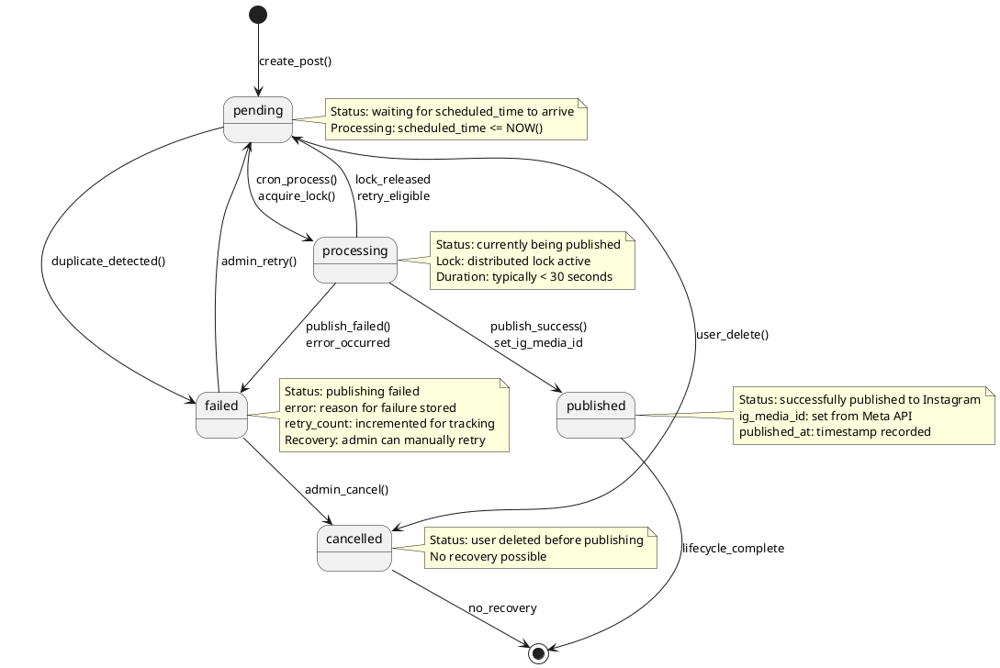

---

## 7. COMPONENT DIAGRAM - System Architecture

```plantuml
@startuml component_architecture
package "Frontend (Next.js App Router)" {
  component Pages as "Pages\n[locale]/memes\n[locale]/schedule\n[locale]/admin/*"
  component Components as "React Components\n<use client> interactive\nServer Components for data"
  component Hooks as "Custom Hooks\nuseSWR, usePostForm\nuseScheduledPosts"
  component Validations as "Client Validations\nZod schemas"
}

package "Authentication & Middleware" {
  component Auth as "NextAuth\nGoogle OAuth\nSupabase Adapter"
  component Middleware as "Route Middleware\nauth verification\nRBAC checks"
}

package "API Layer (Next.js Route Handlers)" {
  component MemesAPI as "/api/memes/*\nsubmit, review,\nschedule, delete"
  component ScheduleAPI as "/api/schedule/*\ncreate, update,\ndelete, insights"
  component AdminAPI as "/api/admin/*\nuser management"
  component WebhookAPI as "/api/webhook/*\nstory, instagram"
  component CronAPI as "/api/cron/*\nprocess, audit"
  component AuthAPI as "/api/auth/*\nlink-facebook,\nextend-token"
}

package "Service Layer" {
  component AuthSvc as "Auth Service\nauthHelpers\nsession mgmt"
  component DBSvc as "Database Services\nScheduledPosts\nMemeSubmission\nLinkedAccount"
  component PublishSvc as "Publishing Service\ncontainer mgmt\nerror handling"
  component MediaSvc as "Media Services\nvalidator\nvideo processor\nphash"
  component ProcessSvc as "Processing Service\nscheduler logic\nlock management"
  component UtilSvc as "Utility Services\nlogger, retry\nnotification"
}

package "External Integrations" {
  component Supabase as "Supabase\nPostgreSQL\nStorage (media)\nAuth adapter"
  component MetaAPI as "Meta Graph API\nInstagram publish\nContainer mgmt\nQuota API"
  component FacebookOAuth as "Facebook OAuth\nToken exchange\nToken refresh"
  component GoogleOAuth as "Google OAuth\nSign-in provider"
}

package "Data & Caching" {
  component Cache as "Client Cache\nSWR (Next.js)\nStorage bucket\nlocal state"
}

' Frontend connections
Pages --> Components: uses
Components --> Hooks: calls
Hooks --> Cache: reads/writes
Components --> Validations: validates with
Pages --> Auth: requires session

' Middleware connections
Middleware --> Auth: checks auth
Middleware --> Pages: protects routes

' API connections
MemesAPI --> AuthSvc: requires auth
MemesAPI --> DBSvc: queries memes
MemesAPI --> MediaSvc: validates media

ScheduleAPI --> AuthSvc: requires auth
ScheduleAPI --> DBSvc: manages posts
ScheduleAPI --> PublishSvc: publishes directly

AdminAPI --> AuthSvc: requires admin role
AdminAPI --> DBSvc: manages users/posts

WebhookAPI --> AuthSvc: webhook auth
WebhookAPI --> PublishSvc: publishes
WebhookAPI --> DBSvc: records post

CronAPI --> ProcessSvc: processes posts
CronAPI --> AuthSvc: cron secret validation
ProcessSvc --> DBSvc: queries pending
ProcessSvc --> PublishSvc: publishes
ProcessSvc --> UtilSvc: logging

AuthAPI --> FacebookOAuth: token exchange
AuthAPI --> DBSvc: saves account

' Service connections
PublishSvc --> MetaAPI: publishes media
PublishSvc --> DBSvc: updates status
PublishSvc --> UtilSvc: logging, retry

ProcessSvc --> DBSvc: locking, queries
ProcessSvc --> PublishSvc: publishes
ProcessSvc --> UtilSvc: logging

DBSvc --> Supabase: CRUD operations
DBSvc --> Cache: invalidates

AuthSvc --> Supabase: session ops
AuthSvc --> GoogleOAuth: sign-in
AuthSvc --> FacebookOAuth: token mgmt

MediaSvc --> Supabase: storage
MediaSvc --> UtilSvc: validation logging

' External integrations
MetaAPI --> FacebookOAuth: requires token
GoogleOAuth --> Supabase: creates user

@enduml
```

---

## 8. DEPLOYMENT DIAGRAM

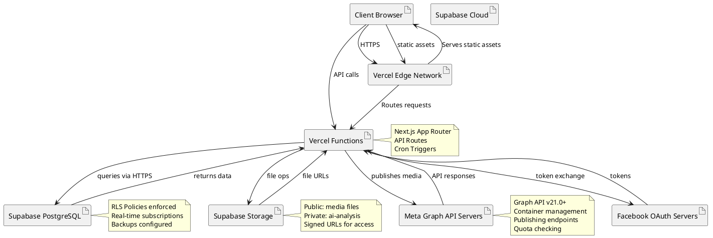

---

## 9. DETAILED STATE MACHINE - Meme Submission Lifecycle

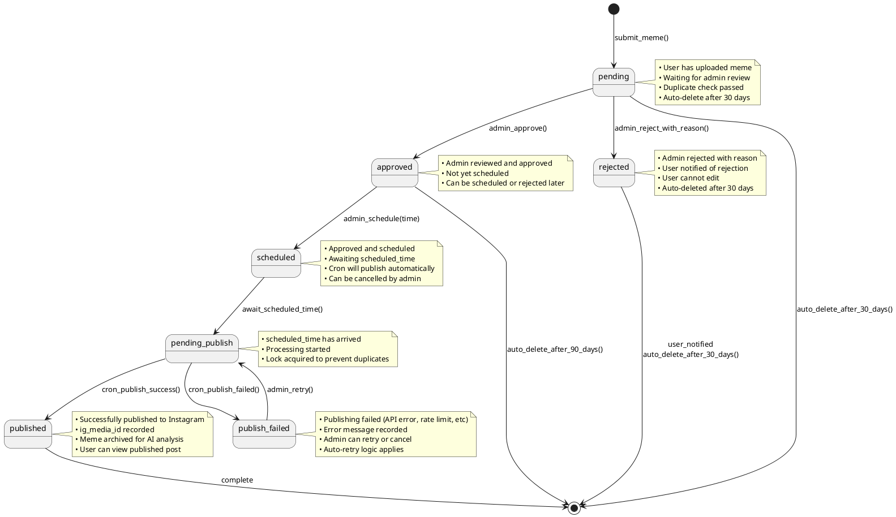

---

## 10. INTEGRATION SEQUENCE - Facebook OAuth Token Refresh

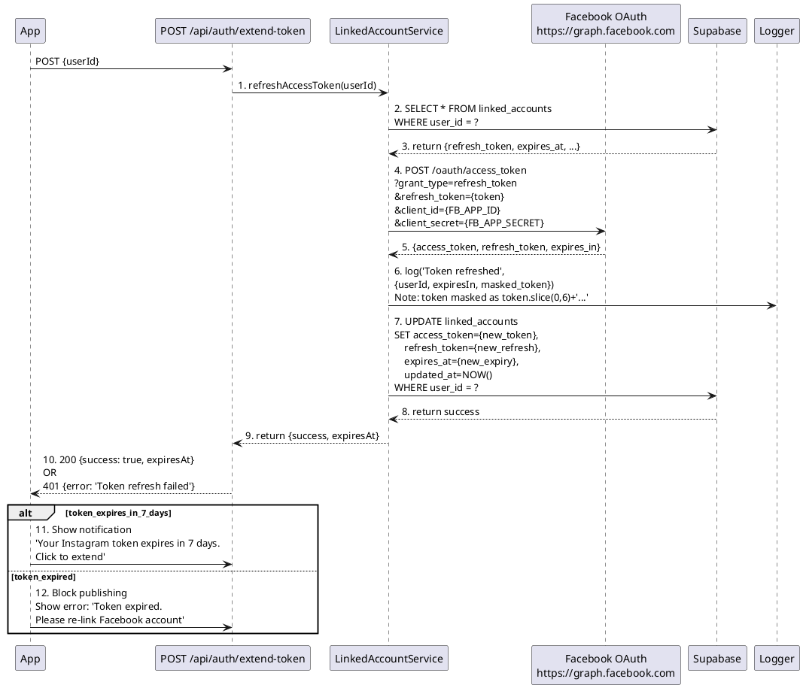

---

## 11. SECURITY CONTEXT DIAGRAM

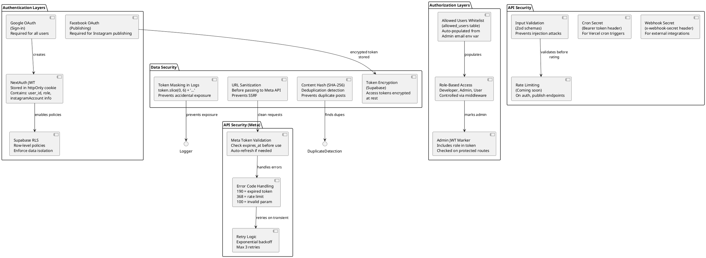

---

## 12. TIMING DIAGRAM - Cron vs Scheduled Time

```plantuml
@startuml timing_cron_vs_scheduled
concise cron as "Cron Process"
concise post as "Scheduled Post"
concise lock as "Processing Lock"

@0
cron is idle
post is pending: "scheduled_time = 14:30"
lock is released

@730
post is pending
note right on post
  scheduled_time approaching
  (14:30 - 1 min = 14:29)
end note

@900
cron is processing: "① Query pending posts"
post is pending: "scheduled_time = 14:30 reached!"

@905
cron is checking: "② Check scheduled_time <= NOW()"
lock is acquired

@910
cron is validating: "③ Validate & check duplicates"
post is pending

@920
cron is publishing: "④ Call publishMedia()"
lock is held

@1130
cron is waiting: "⑤ Poll container status"
lock is held

@1200
cron is publishing_cont: "⑥ Publish container"
lock is held

@1210
cron is completing: "⑦ Update status=published"
post is published: "ig_media_id set"
lock is released

@1215
cron is idle
post is published
lock is released

@enduml
```

---

## 13. DATA FLOW DIAGRAM - End-to-End Publishing

```
┌─────────────────────────────────────────────────────────────────────┐
│                     DATA FLOW: Meme to Instagram                     │
└─────────────────────────────────────────────────────────────────────┘

┌──────────────┐
│ User Uploads │
│  Meme File   │
└──────┬───────┘
       │ (media_url, caption, title)
       ▼
┌──────────────────┐
│ Validation Layer │───► Check: file type, size, dimensions
│                  │───► Duplicate check: content hash
└──────┬───────────┘
       │ (validated meme data)
       ▼
┌────────────────────────┐
│ Supabase Storage &     │───► Store media file (public URL)
│ meme_submissions table │───► Insert meme record (status=pending)
└──────┬─────────────────┘
       │ (meme_id, status, content_hash)
       ▼
┌──────────────────────┐
│ Admin Review Panel   │
│ (Dashboard)          │
└──────┬───────────────┘
       │ (admin decision: approve/reject/schedule)
       ▼
    IF APPROVED & SCHEDULED:
┌─────────────────────────────────┐
│ Create scheduled_posts entry    │
│ - url = meme.media_url          │
│ - status = pending              │
│ - scheduled_time = admin choice │
│ - meme_id reference             │
└──────┬────────────────────────────┘
       │
       ▼
    WAIT FOR SCHEDULED_TIME
       │
       ▼
┌─────────────────────────────────┐
│ Vercel Cron Trigger             │ (every minute)
│ /api/cron/process               │
└──────┬────────────────────────────┘
       │ Query: scheduled_posts where
       │   status='pending' AND
       │   scheduled_time <= NOW()
       ▼
┌─────────────────────────────────┐
│ Acquire Processing Lock         │
│ (Prevent duplicate processing)  │
└──────┬────────────────────────────┘
       │
       ▼
┌─────────────────────────────────┐
│ Duplicate Content Check         │
│ Compare content_hash with       │
│ published posts (24h window)    │
└──────┬────────────────────────────┘
       │ IF NO DUPLICATES:
       ▼
┌─────────────────────────────────┐
│ Publishing Service              │
│ 1. publishMedia(url, type,      │
│    caption, userId)             │
└──────┬────────────────────────────┘
       │
       ├─► Fetch user's Instagram token
       │   from linked_accounts
       │
       ├─► Call Meta Graph API:
       │   POST /media
       │   - image_url = meme.url
       │   - caption = meme.caption
       │   - media_type = IMAGE
       │   - access_token
       │   RETURNS: container_id
       │
       ├─► Poll /media status:
       │   GET /container?fields=status
       │   UNTIL status=FINISHED or ERROR
       │
       ├─► Publish container:
       │   POST /media_publish
       │   - creation_id = container_id
       │   - access_token
       │   RETURNS: ig_media_id
       │
       ▼
┌─────────────────────────────────┐
│ Update Database                 │
│ UPDATE scheduled_posts:         │
│ - status = published            │
│ - ig_media_id = from Meta API   │
│ - published_at = NOW()          │
│ - processing_lock = NULL        │
└──────┬────────────────────────────┘
       │
       ├─► Archive for AI Analysis
       │   INSERT ai_meme_analysis
       │   - download media file
       │   - upload to ai-analysis bucket
       │   - track metadata
       │
       ├─► Update meme record
       │   UPDATE meme_submissions
       │   - status = published
       │   - ig_media_id = same
       │
       ▼
┌─────────────────────────────────┐
│ Logging & Notifications         │
│ - Log success                   │
│ - Notify admin                  │
│ - Send user notification        │
└──────┬────────────────────────────┘
       │
       ▼
┌─────────────────────────────────┐
│ Instagram User Story Stream     │
│ (published, visible to followers)
└─────────────────────────────────┘

═════════════════════════════════════════════════════════════════════
ERROR HANDLING PATHS:

IF DUPLICATE DETECTED:
  → Mark status = failed
  → error = "Duplicate content detected"
  → Log warning

IF DUPLICATE CHECK FAILS:
  → Mark status = failed
  → error = error message
  → retry_count++

IF PUBLISHING FAILS:
  → Mark status = failed
  → error = "Meta API error: [code] [message]"
  → IF retryable error (5xx, 429):
       retry_count++, status stays pending (retry next cron)
  → IF non-retryable error (4xx auth, 404):
       Mark final failed, manual review needed
  → Log error with context

IF LOCK ACQUISITION FAILS:
  → Skip post (already being processed)
  → Log info "Post already processing"

═════════════════════════════════════════════════════════════════════
```

---

## Summary

This comprehensive UML documentation includes:

1. **ER Diagram** - All database tables, relationships, and policies
2. **Class Diagram** - Services, methods, and dependencies
3. **Sequence Diagrams** - Meme submission flow, webhook publishing, token refresh
4. **Activity Diagram** - Cron processor decision flow
5. **State Diagrams** - Post and meme submission lifecycle
6. **Component Diagram** - System architecture and integration points
7. **Deployment Diagram** - Cloud infrastructure and external services
8. **Security Context** - Authentication, authorization, and data security
9. **Timing Diagram** - Cron triggers vs scheduled times
10. **Data Flow** - End-to-end publishing pipeline with error paths

All diagrams can be rendered using PlantUML (convert to PNG/SVG via online tools or local installation).
