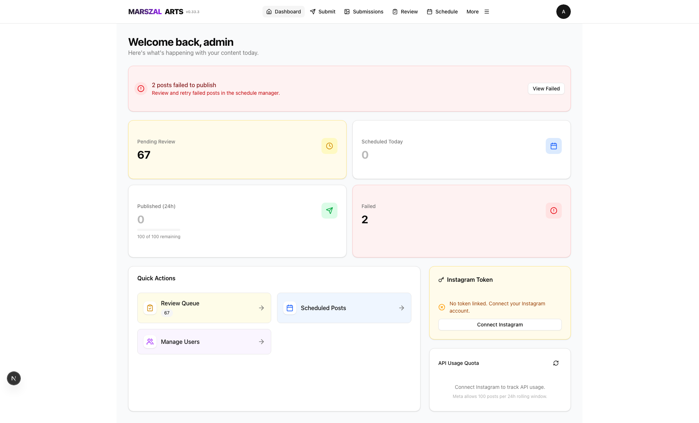
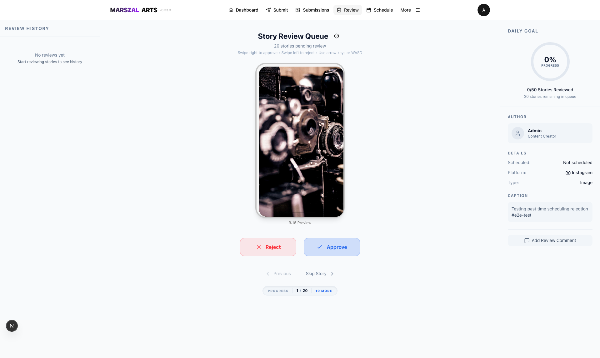
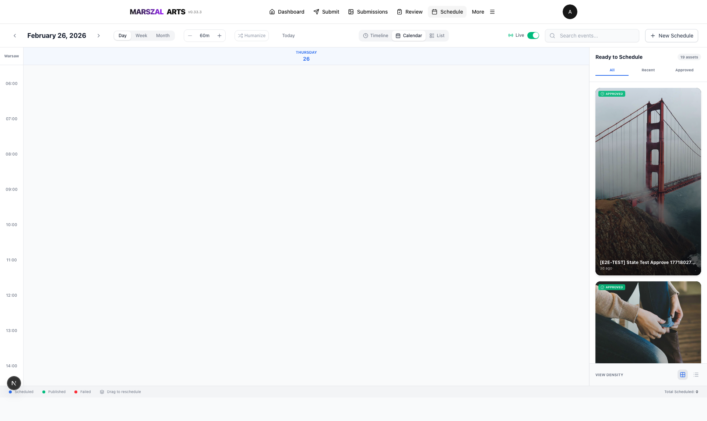
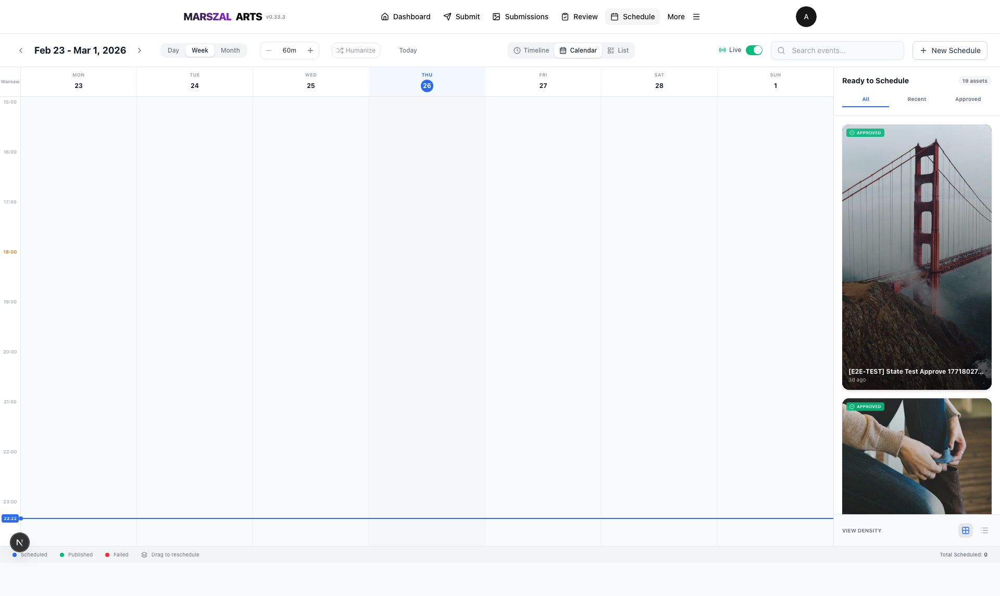
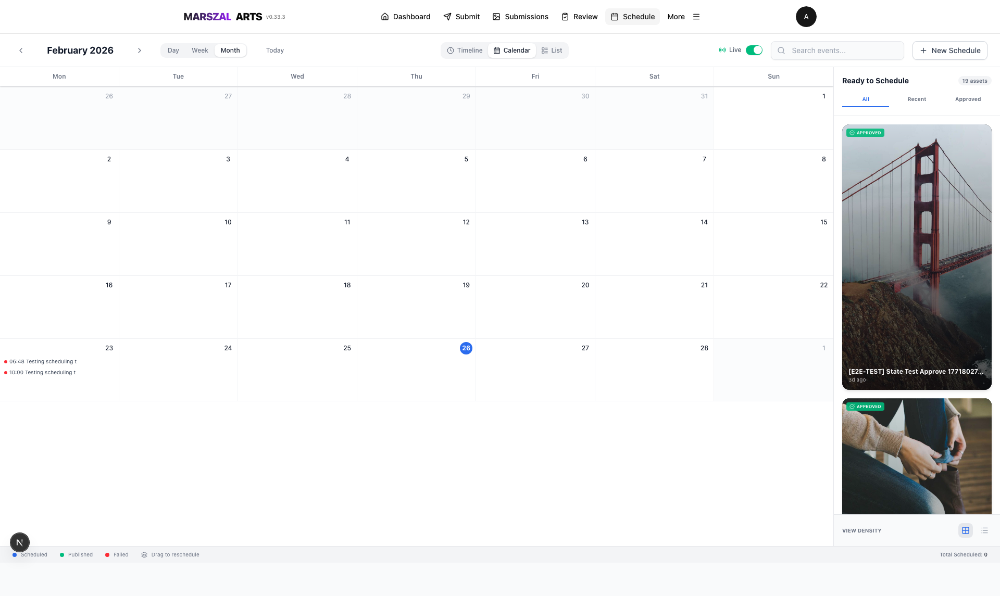
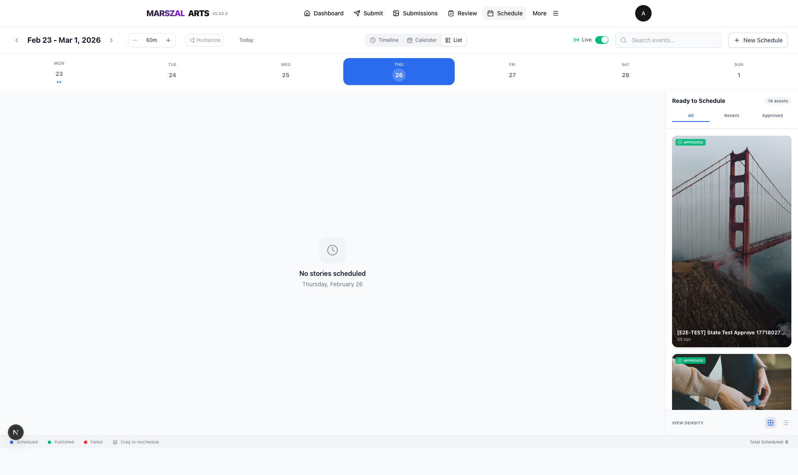

# Instagram Story Automation Platform

[](https://nextjs.org)
[](https://react.dev)
[](https://typescriptlang.org)
[](https://supabase.com)
[](https://playwright.dev)
[](https://vercel.com)

> **Note:** Development was stopped after discovering [Buffer.com](https://buffer.com) covers the same use case as a mature SaaS product. This repo is preserved as a portfolio piece documenting the full build, from first commit to production-ready system.

A full-stack Next.js application for programmatic Instagram Story publishing via the Meta Graph API. Built solo over **123.5 hours** across 41 days, shipping **35 versioned releases** and **499 commits** — from blank repo to production with 22+ pages, mobile-first UX, distributed scheduling, video processing, and a 113-test E2E suite running against the real Instagram API.

---

## Why This Project Is Interesting

This wasn't a tutorial project or a CRUD app with extra steps. It involved solving real distributed-systems problems, integrating with a notoriously finicky third-party API (Meta Graph API), and building production UX patterns that go beyond what most portfolios demonstrate.

### The Hardest Problems I Solved

**1. Distributed Cron Scheduling on Serverless**

Vercel spins up multiple function instances simultaneously. A naive cron job publishes the same story twice. I built a database-level distributed locking system (`cron_locks` table with atomic insert-or-update) that prevents overlapping executions, auto-recovers stale locks after 5 minutes, and gates on Instagram's API quota (200 calls/hour) — all in a serverless environment with no persistent process.

The core scheduler (`lib/scheduler/process-service.ts`, 671 lines) handles: lock acquisition, token validation, duplicate detection via content hashing, the three-step Instagram container publish flow, exponential backoff retries, quota snapshots, and admin alerting when tokens approach expiry.

**2. Three-Tier Video Processing Pipeline**

Instagram Stories require exact 9:16 aspect ratio, H.264 encoding, max 57 seconds. Users upload arbitrary video files. I built a three-tier processing pipeline:
- **Tier 1 (Client):** FFmpeg.wasm runs in the browser for instant feedback — validates duration, shows aspect ratio warnings
- **Tier 2 (Server Cron):** Every 5 minutes, a cron job picks up unprocessed videos, transcodes via FFmpeg (resize, pad/crop to 1080x1920, re-encode H.264 at 10Mbps)
- **Tier 3 (Upload Bypass):** Videos upload directly from browser to Supabase Storage using signed URLs, bypassing the 4.5MB server body limit entirely

**3. Meta Graph API's Three-Step Container Flow**

Instagram doesn't have a simple "post this image" endpoint. Publishing requires: (1) create a media container, (2) poll its status until `FINISHED` (up to 60 iterations), (3) publish the container. Each step can fail with different error codes — 190 (token expired), 368 (action blocked/rate limited), transient 5xx errors. I built a retry-aware publisher with error classification (retryable vs. permanent), structured logging, and automatic token refresh mid-flight.

**4. Real-Time Multi-User State Synchronization**

Multiple admins editing the same content queue simultaneously. I combined SWR cache with Supabase WebSocket subscriptions for real-time sync, optimistic UI updates with rollback on conflict, and discovered (the hard way) that iOS Safari's Chrome wrapper throws `"WebSocket not available: The operation is insecure"` — requiring a try-catch fallback around every `.subscribe()` call.

**5. Mobile-First Gesture Interfaces**

The review queue uses Tinder-style swipe gestures (swipe right = approve, left = reject) built with `@use-gesture/react` and `pointer-events` with intermediate `mouse.move()` steps for smooth tracking. The schedule uses `@dnd-kit` drag-and-drop from a sidebar onto calendar time slots. Both needed extensive work to feel native on touch devices — not just "it works on mobile" but actually pleasant to use.

---

## What I Built

### Authentication

Google OAuth with role-based access control (user/admin/developer). Test mode buttons in development for rapid iteration.


### Admin Dashboard

Real-time overview: publishing stats, queue health, system status, and quick actions.



### Review Queue (Swipe-to-Decide)

Tinder-style content review. Swipe right to approve, left to reject. Keyboard shortcuts for power users. Dedicated mobile layout with touch gestures.



### Schedule (4 Views)

Drag-and-drop scheduling with day, week, month, and list views. "Humanize" mode adds random 1-4 minute offsets to avoid robotic posting patterns.

| Day View | Week View |
|:-:|:-:|
|  |  |

| Month View | List View |
|:-:|:-:|
|  |  |

> The app has 22+ pages total including content submission, Kanban board, analytics, Instagram Insights, user management, and more. Full visual guide: [docs/VISUAL-GUIDE.md](docs/VISUAL-GUIDE.md)

---

## Architecture

```
                    ┌──────────────────────────────────┐
                    │   Client (React 19 / Next.js 16) │
                    │   Server + Client Components      │
                    │   SWR + Supabase Realtime         │
                    └────────────┬─────────────────────┘
                                 │
              ┌──────────────────┼──────────────────┐
              │                  │                  │
    ┌─────────▼──────┐  ┌───────▼───────┐  ┌──────▼────────┐
    │  API Routes     │  │  Cron Jobs    │  │  Webhooks     │
    │  (Serverless)   │  │  (every 1min) │  │  (external)   │
    └─────────┬──────┘  └───────┬───────┘  └──────┬────────┘
              │                 │                  │
              └────────┬────────┴──────────────────┘
                       │
         ┌─────────────┼─────────────┐
         │             │             │
   ┌─────▼─────┐ ┌────▼────┐ ┌─────▼──────┐
   │ Supabase  │ │ Meta    │ │ Supabase   │
   │ Postgres  │ │ Graph   │ │ Storage    │
   │ + RLS     │ │ API     │ │ (S3)       │
   └───────────┘ └─────────┘ └────────────┘
```

**Content Lifecycle:**
```
User uploads media → Deduplication (SHA-256 hash)
  → Admin review (swipe approve/reject)
  → Schedule (drag onto calendar slot)
  → Cron picks up at scheduled time
  → Distributed lock acquired
  → Instagram container created → polled → published
  → Lock released, analytics recorded
```

---

## Tech Stack

| Layer | Technology | Why This Choice |
|:------|:-----------|:----------------|
| **Framework** | Next.js 16, React 19 | App Router, Server Components, Streaming SSR |
| **Language** | TypeScript (strict, zero `any`) | Runtime safety at API boundaries via Zod |
| **Database** | Supabase (PostgreSQL + RLS) | Row-level security, realtime WebSockets, auth |
| **Auth** | NextAuth + Google/Facebook OAuth | Multi-provider with role-based access control |
| **Media** | FFmpeg (wasm + server), Sharp | Client-side preview, server-side transcoding |
| **UI** | Tailwind CSS 4, shadcn/ui, Radix | Accessible primitives, design system consistency |
| **DnD** | @dnd-kit | Kanban boards, calendar drag-and-drop scheduling |
| **Gestures** | @use-gesture/react | Swipe-to-review touch interface |
| **Monitoring** | Sentry | Error tracking with module/route context tags |
| **Testing** | Playwright (113 E2E), Vitest (500+ unit) | Real Instagram API in E2E, MSW mocks in unit |
| **CI/CD** | GitHub Actions, Vercel | Multi-gate pipeline: lint → build → E2E → promote |
| **Deployment** | Vercel (serverless + cron) | Preview per PR, production promotion after E2E pass |

---

## Testing & Deployment Pipeline

### Test Pyramid

| Layer | Tool | Count | External APIs |
|:------|:-----|------:|:--------------|
| Unit | Vitest + MSW | ~500 | Mocked |
| Integration | Vitest + Supabase | ~200 | Mocked |
| E2E (Preview) | Playwright | ~40 | Skipped |
| E2E (Production) | Playwright | ~113 | **Real Instagram API** |

### Production Deployment (4 Gates)

```
PR to master
  │
  ├─ Gate 1: Quality (lint + typecheck + unit tests)
  │
  ├─ Gate 2: Preview Deploy (Vercel) + health check
  │
  ├─ Gate 3: E2E Suite (5 parallel shards, ~10 min)
  │           113 tests against real Instagram API
  │
  └─ Gate 4: Promote preview → production
```

Every PR runs through all 4 gates. No manual deployment. No skipping tests.

---

## Skills This Project Developed

| Area | What I Learned |
|:-----|:---------------|
| **Distributed Systems** | Database-level locking, cron deduplication, stale lock recovery on serverless |
| **Third-Party API Integration** | Meta Graph API's container flow, token lifecycle, error code taxonomy, rate limit management |
| **Media Engineering** | FFmpeg transcoding pipelines, client-side wasm processing, direct-to-storage uploads bypassing server limits |
| **Real-Time UX** | WebSocket subscriptions, optimistic updates with rollback, cross-browser compatibility (iOS Safari workarounds) |
| **Mobile-First Design** | Touch gesture interfaces, dedicated mobile layouts (not just responsive), bottom navigation patterns |
| **Production Ops** | Multi-gate CI/CD, E2E testing against real APIs, Sentry integration, cron monitoring dashboards |
| **Security** | RLS policies, token encryption at rest, webhook HMAC verification, admin audit logging |
| **Full-Stack Architecture** | Server Components vs. Client Components, SWR caching strategy, Zod validation at boundaries |

---

## By The Numbers

| Metric | Value |
|:-------|------:|
| Development time | 123.5 hours |
| Calendar span | 41 days (Jan 12 - Feb 22, 2026) |
| Releases | 35 semantic versions |
| Commits | 499 |
| Pages/views | 22+ |
| Unit tests | ~500 |
| E2E tests | 113 |
| Average time per release | 3.5 hours |

---

## Local Setup

> Preserved for reference. The project is no longer under active development.

```bash
git clone https://github.com/PiotrRomanczuk/instagram-stories-webhook.git
cd instagram-stories-webhook
npm install
npm run dev
```

Requires: Node.js 20+, Supabase project, Google OAuth credentials, Meta Business Account with Instagram Professional Account.

See [CLIENT_SETUP_GUIDE.md](docs/CLIENT_SETUP_GUIDE.md) and [DEPLOYMENT_GUIDE.md](docs/DEPLOYMENT_GUIDE.md) for full configuration.

---

## Further Documentation

| Document | Contents |
|:---------|:---------|
| [Architecture & Workflows](docs/comprehensive/ARCHITECTURE_AND_WORKFLOWS.md) | System diagrams, data flows, state machines |
| [Testing Strategy](docs/TESTING_STRATEGY.md) | Test pyramid, E2E philosophy, mock boundaries |
| [Deployment Guide](docs/DEPLOYMENT_GUIDE.md) | CI/CD pipeline, environment setup, cron config |
| [Feature History](docs/non-technical/FEATURE_IMPLEMENTATION_HISTORY.md) | All 35 releases with hours, features, and decisions |
| [Troubleshooting](docs/TROUBLESHOOTING.md) | Common Meta API errors and fixes |

---

*Built by Piotr Romanczuk | 35 releases, 123.5 hours, 499 commits | Alternative for the use case: [Buffer.com](https://buffer.com)*
