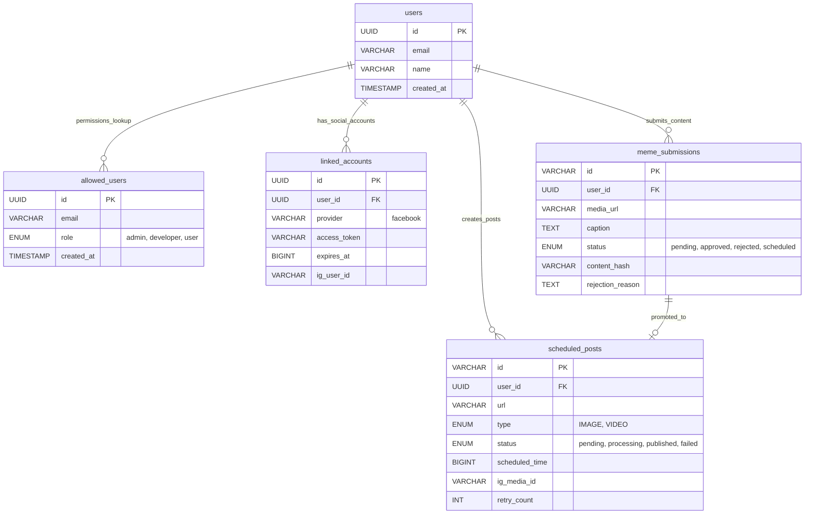
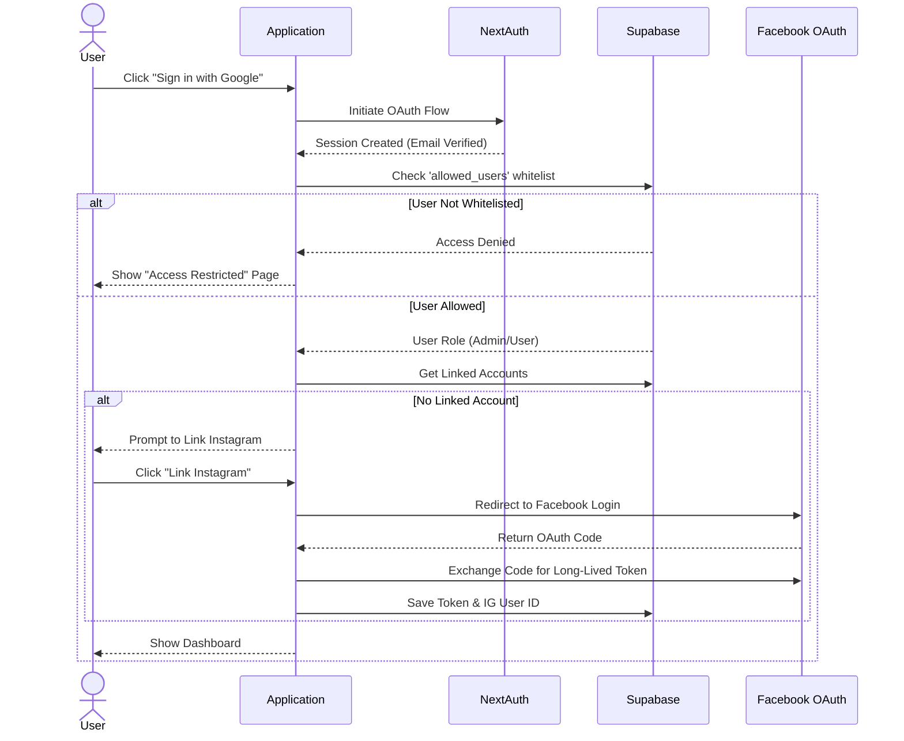
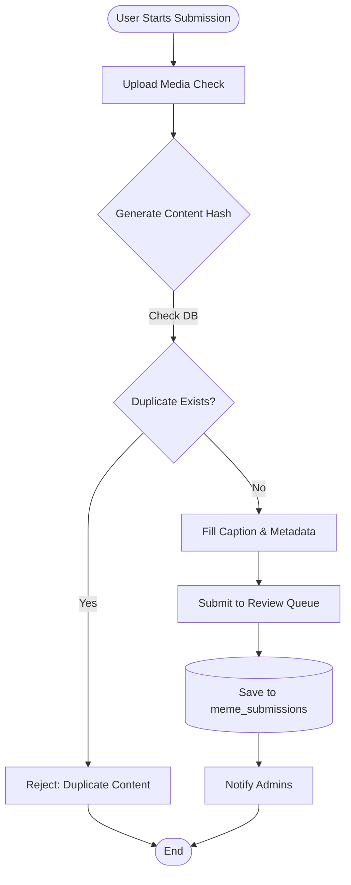
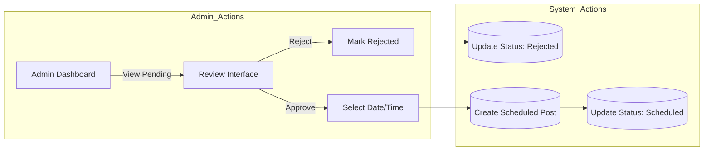
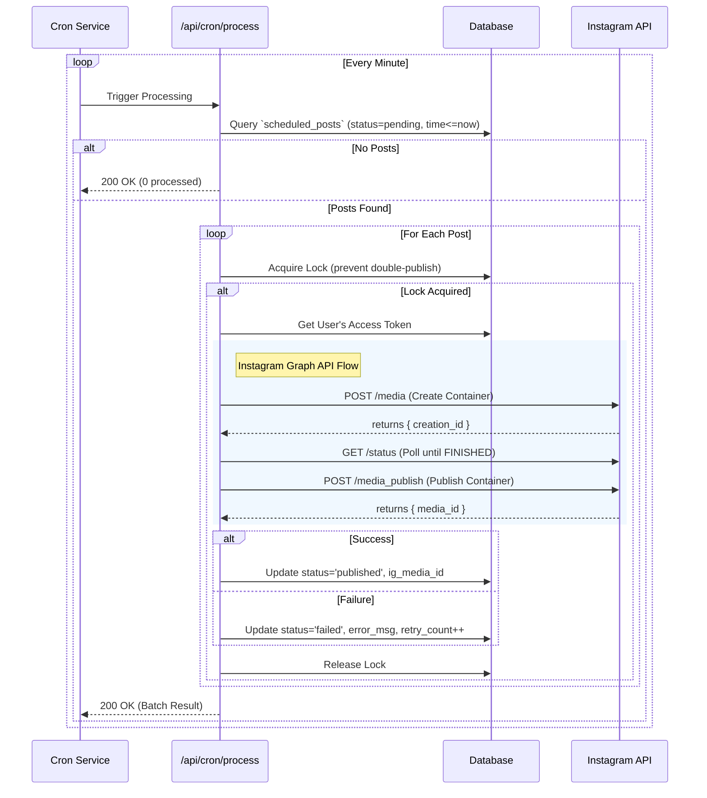

# Comprehensive Architecture & User Workflows

This document provides a comprehensive overview of the application architecture, user workflows, and data flow, visualized through diagrams.

---

## 1. System Architecture Overview

The application is built using a modern full-stack TypeScript architecture, leveraging **Next.js 16 (App Router)** for both frontend and backend API, **Supabase** for database and authentication, and **Instagram Graph API** for content publishing.

### High-Level Architecture Diagram

```mermaid
graph TD
    subgraph "Frontend (Client)"
        Browser[User Browser]
        NextApp[Next.js App Router]
        ClientComp[Client Components]
        ServerComp[Server Components]
    end

    subgraph "Backend Services (Server)"
        API[Next.js API Routes]
        Cron[Cron Job Service]
        Auth[NextAuth.js]
        MediaProc[Media Processor (FFmpeg/Sharp)]
    end

    subgraph "External Services"
        Supabase[(Supabase PostgreSQL)]
        Storage[Supabase Storage]
        IG_API[Instagram Graph API]
        Webhook[External Webhooks]
    end

    Browser -->|HTTPS| NextApp
    NextApp -->|SSR/RSC| ServerComp
    NextApp -->|Interactivity| ClientComp
    
    ClientComp -->|Fetch| API
    ServerComp -->|Async Data| Supabase
    ServerComp -->|Auth| Auth

    API -->|Query| Supabase
    API -->|Upload| Storage
    API -->|Publish| IG_API

    Cron -->|Poll Pending Posts| API
    Webhook -->|Trigger| API

    Auth -->|OAuth| Supabase
```

---

## 2. Technology Stack

| Layer | Technology | Description |
|-------|------------|-------------|
| **Frontend** | React 19, Next.js 16 | App Router, Server Components |
| **Styling** | Tailwind CSS 4 | Utility-first CSS framework |
| **UI Library** | Radix UI | Headless accessible components |
| **Backend** | Next.js API Routes | Serverless functions |
| **Database** | PostgreSQL | Managed by Supabase |
| **Auth** | NextAuth.js | Authentication w/ Google Provider |
| **Storage** | Supabase Storage | S3-compatible object storage |
| **Testing** | Vitest, Playwright | Unit and E2E testing |
| **Scheduling** | Vercel Cron | Scheduled task execution |

---

## 3. Database Schema (ERD)

The database manages users, permissions (whitelist), social accounts, and content (memes/posts).



---

## 4. User Workflows

### 4.1. User Onboarding & Authentication
Users must be whitelisted to access the system. Once authenticated via Google, they link their Facebook/Instagram account to enable publishing.



### 4.2. Meme Submission Workflow
Users submit content for review. The system checks for duplicates using content hashing before accepting the submission.



### 4.3. Admin Review & Scheduling Workflow
Admins review pending submissions and decide whether to approve/schedule them or reject them.



---

## 5. Automation & Data Flow

### 5.1. Scheduling & Publishing Process (Cron Job)
This process runs every minute to check for posts due for publishing. It handles locking, publishing to Instagram, and error recovery.



### 5.2. Webhook Data Flow
External services can trigger immediate story publishing via webhooks (e.g., from an automation tool like scriptable).

```mermaid
graph LR
    External[External System] -->|POST /api/webhook/story| WebhookAPI
    WebhookAPI -->|Validate Secret| AuthCheck{Authorized?}
    
    AuthCheck -- No --> 401[401 Unauth]
    
    AuthCheck -- Yes --> Payload[Parse Payload\n(url, caption)]
    Payload --> PublishService[Publishing Service]
    
    PublishService -->|Get Token| DB[(Database)]
    PublishService -->|Upload/Publish| IG[Instagram API]
    
    IG -->|Success ID| WebhookAPI
    WebhookAPI -->|200 OK| External
    
    PublishService -->|Log Entry| DB
```
